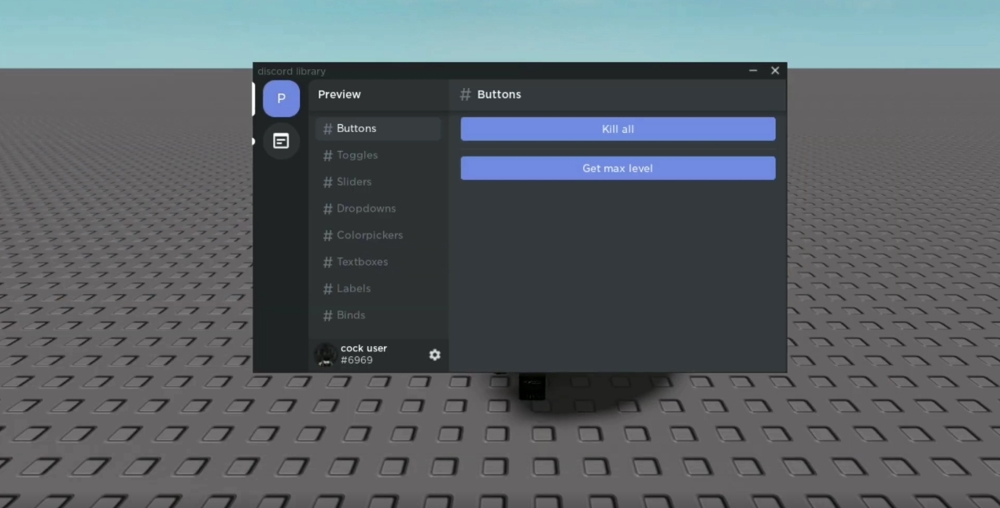

This is NOT Made by me, Credits to the owner.

Credits to Bloodball for Discord UI Script

i'm wasting my time for y'all to have a friendly documentation.

i will be releasing a lib, who knows? maybe not.


Showcase:



### Booting Up the Library

```lua

local DiscordLib = loadstring(game:HttpGet "https://raw.githubusercontent.com/bloodball/-back-ups-for-libs/main/discord")()

```


### Making the Library's Title

```lua

local win = DiscordLib:Window("discord library")

```


### Creating a Server

```lua

local serverid = win:Server("Preview", "https://www.roblox.com/library/4689592025/White-Roblox-Icon")

```


### Creating a Channel

```lua

local channelid = serverid:Channel("testing")

```


### Creating a Button

```lua

channelid:Button(
    "Test",
    function()
    DiscordLib:Notification("Notification Title", "Description", "button text")
  end
)

```


### Creating a Separator

```lua

channelid:Separator()

```

### Creating a Toggle

```lua
channelid:Toggle(
    "Test",
    false,
    function(bool)
        print(bool)
    end
)
```

### Creating a Slider

```lua
local slider =
channelid:Slider(
    "Slide me!",
    0,
    1000,
    400,
    function(t)
        print(t)
    end
)
```

### Updating a Slider

```lua
slider:Change(50)
```

### Creating a Dropdown

```lua
local drop =
    channelid:Dropdown(
    "Pick me!",
    {"Option 1", "Option 2", "Option 3", "Option 4", "Option 5"},
    function(bool)
        print(bool)
    end
)
```

### Clear Dropdowns

```lua
drop:Clear()
```

### Add Dropdown Options

```lua
drop:Add("Option")
```

### Creating a Color Picker

```lua
channelid:Colorpicker(
    "Color",
    Color3.fromRGB(255, 1, 1),
    function(t)
        print(t)
    end
)
```

### Creating a Textbox

```lua
textbs:Textbox(
    "Title here",
    "Type here!",
    true,
    function(t)
        print(t)
    end
)
```
